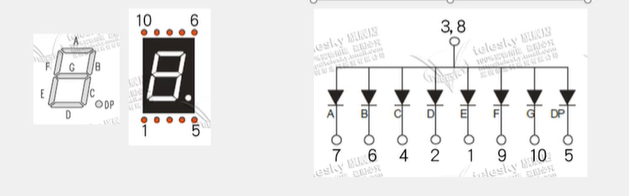
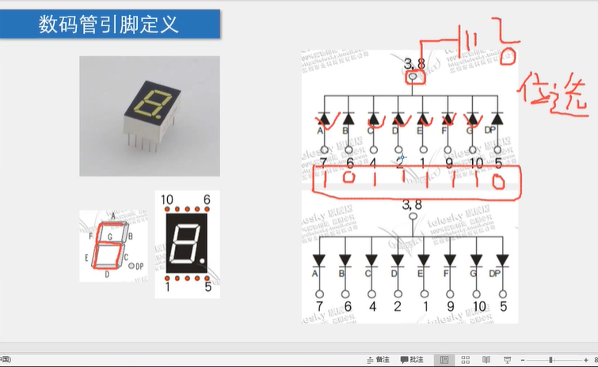
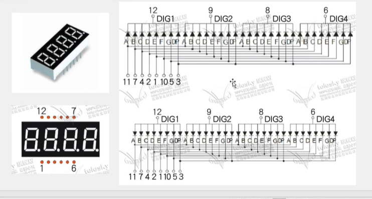
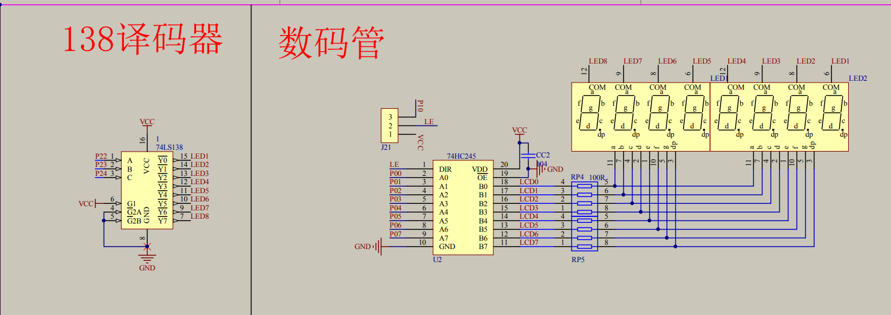

# 4-1 静态数码管显示

1. led数码管原理
   led数码管本质上是由多个led（发光二极管）构成的。其电路图如下：
   图一

   图二
   其中图一所有的led负极都练到了一个端口上，则这种链接方式叫做共阴极连接。同理，图二所有的阳极都连到了一个端口上，为共阳极连接。***一个led称为一段***，则一个led数码管有八段，恰好和一字节有八位相对应。 
   显示原理和led一样。以图一为例，如果想要显示数字6，则AFEGDC段的引脚7 9 1 10 2 4设置为高电平，将3 8引脚接到GND，共阳极led数码管同理，将AFEGDC段的引脚7 9 1 10 2 4设置为低电平，将3 8引脚接到VCC。
   
   其中“10111110”叫做段码，7 6 4 2 1 9 10 5引脚叫做位选（端)，3 8引脚叫做公共端。

   下图的led数码管的原理和上述led数码管相同。

   11 7 4 2 1 10 5 3引脚叫做位选（端），12 9 8 6叫做公共端。如果数码管是共阳极，则段码叫做阴码，反之则为阳码。

   

   ***注意：根据数码管的原理，上述的数码管无法同时显示多个不同的数据，因为他们的位选端都是相同的。***

2. 数码管动态显示数字原理

   快速的切换公共端和位选端显示数字，利用人的视觉残留给人一种显示不同数字的感觉。

3. 138译码器和74HC245原理
   
   ***注意：COM的意思是公共端***

   **138译码器的工作原理**：假设数码管是共阴极数码管，目的是要在LED1显示数字1，则需要设置LED1共阴极为0，其余的设置为1，即将138译码器中的端口15设置为0其余的设置为1。138译码器的作用是使用三个io口控制8个数码管。左边的ABC为输入端，右边的Y0到Y7是输出端。ABC相当于八进制中的一位，即三位二进制000，从右到左（低到高位)分别对应CBA，如果引脚c的电平为高电平其余的为低电平，则译码器将对应的三个电平转换为十进制4，将LED4对应的端口Y3设置为低电平0，其余的设置为1，此时LED4被选中，接下来对74HC245进行操作输出对应的阳码即可显示数字。G1 G2A G2B为使能端，将G1设置为高电平，将G2A G2B设置为低电平，此时译码器才可以工作。

   **74HC245工作原理**：74HC245是一个双向数据缓冲器，同时可以”增大“单片机引脚的电流。OE（应该叫做CE“chip on able”)端为使能端，低电平使能。DIR为控制方向，控制数据缓冲方向，即将右边的B端的数据缓冲到A端或者将A端的数据缓冲到B端，高电平时将左边的数据发送到右边，低电平则反过来（注意：开发板上的跳线帽可以控制LE的接线，如电路图所示)。A0 到 A7引脚分别对应 B0 到 B7引脚，A端为高电平，对应的B端也为高电平，这样链接的原因是74HC245用来”增大“端口的高电平，提高单片机驱动能力，因为单片机端口的高电平的电流很弱，如果直接使用单片机引脚的高电平驱动数码管，电流会很小，灯会很暗

   **电路图符号解释**：CC2表示一个电容，104表示100 000pF，作用是过滤电流，是输出电流更加稳定。RP4表示一个排阻，100R表示一百欧，作用是防止电流过大。