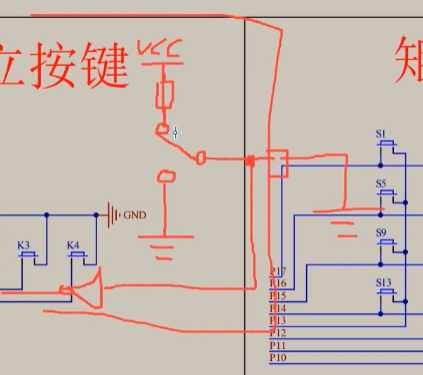

# 6-1矩阵键盘

### 单片机IO口

51单片机io口的模式是***弱上拉模式***（也叫做准双向口），即弱上拉强下拉。简单来说，io口内部的结构可以简单的理解为一下结构，vcc通过一个上拉电阻连接的一个连接点，gnd连接到另外一个连接点。程序可以设置开关选择性地将vcc或者gnd链接到io，然后再将一个施密特触发器连接到io口。此时如果io口连接到gnd，虽然内部上拉设置为高电平，但是引脚接的是gnd，那么io口就保持不了高电平了，会被外界的gnd强下拉给下拉到低电平，施密特触发器将告诉程序io口输入为零；如果内部上拉，那么引脚就会处于“高电平”状态，将io口输出1。所以io口既可以input又可以output。如果想了解更多的有关模式的知识，可以参考手册。

一般按键都是一头接到gnd，另一头接到引脚，将引脚设置为高电平，按下按键是读取0，而不是另一头接到vcc，然后将引脚设置为低电平，按下按键是读取1，因为这样容易损坏单片机。